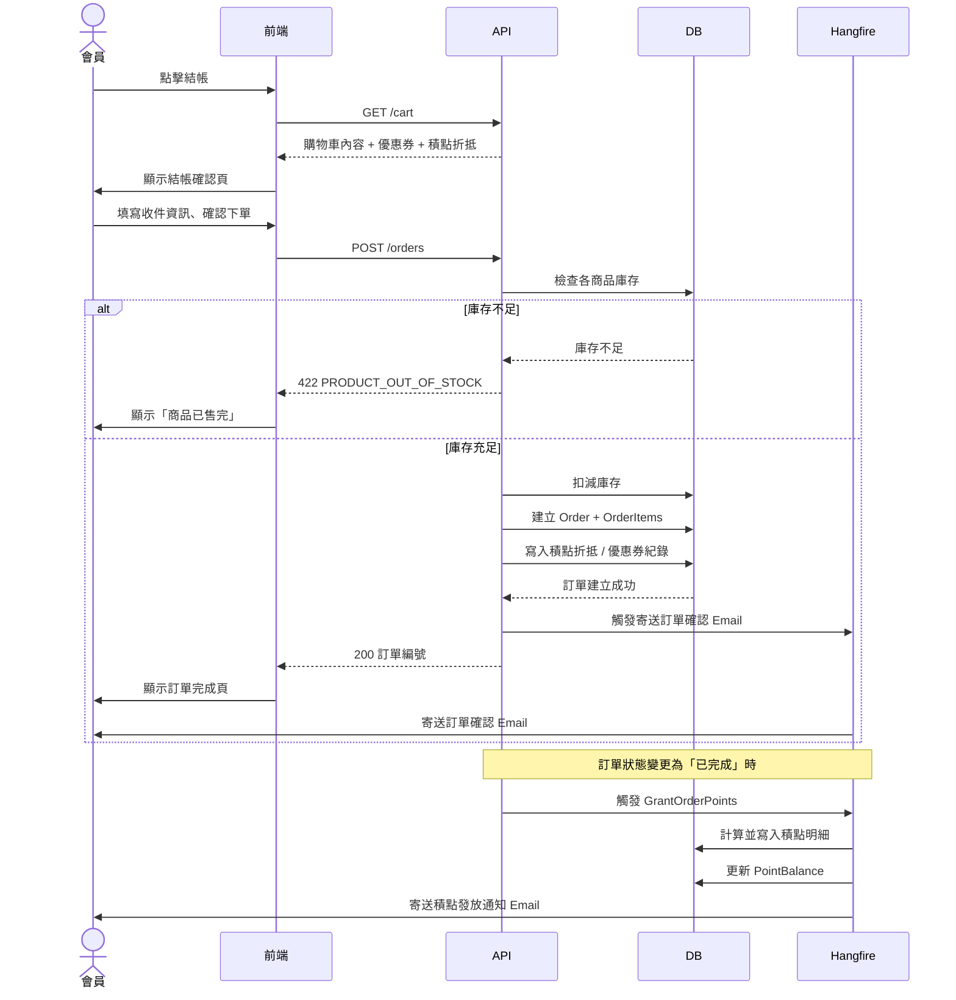
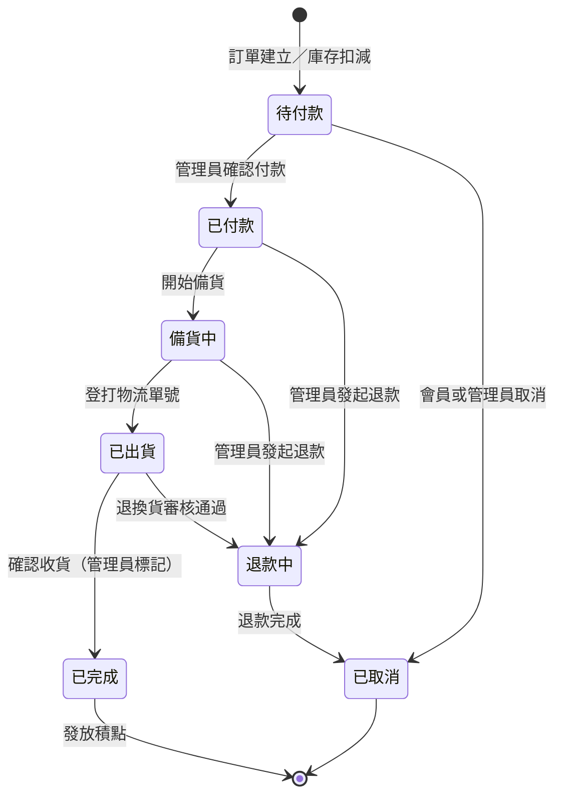

# 系統分析文件（SA Document）
## B2C 購物網站

| 項目 | 內容 |
|------|------|
| 文件版本 | v1.2 |
| 建立日期 | 2026-04-08 |
| 商業模式 | B2C（企業對消費者） |
| 語系支援 | 繁體中文、英文、日文（閱讀用途，配送限台灣） |
| 商品類型 | 實體商品 + 數位商品 |

---

## 1. 專案概述

本系統為一套多語系 B2C 電子商務平台，支援實體商品與數位商品的混合銷售。系統初期聚焦於核心購物流程，金流模組採模組化設計，預留後續串接多種支付方式的擴充彈性。

---

## 2. 系統角色（Actors）

| 角色 | 說明 |
|------|------|
| **訪客（Guest）** | 未登入的使用者，可瀏覽商品、加入購物車 |
| **會員（Member）** | 已登入的消費者，可完成下單、查看訂單、管理收藏 |
| **後台管理員（Admin）** | 管理商品、訂單、會員、促銷活動 |
| **系統（System）** | 自動執行通知、庫存扣減、訂單狀態流轉等 |

---

## 3. 功能需求（Functional Requirements）

### 3.1 會員管理模組

| ID | 功能 | 說明 |
|----|------|------|
| M-01 | 會員註冊 | 支援 Email 註冊，可擴充 OAuth（Google、LINE） |
| M-02 | 會員登入 / 登出 | JWT-based Session 管理 |
| M-03 | 忘記密碼 | 寄送重設連結至 Email |
| M-04 | 會員資料管理 | 姓名、電話、收件地址（可儲存多組） |
| M-05 | 訂單歷史查詢 | 依狀態、日期篩選 |

### 3.2 商品模組

| ID | 功能 | 說明 |
|----|------|------|
| P-01 | 商品列表 | 支援分頁、排序（價格、熱門度、上架時間） |
| P-02 | 商品分類 | 多層分類樹狀結構（實體 / 數位分類區分） |
| P-03 | 商品搜尋 | 關鍵字搜尋、標籤篩選 |
| P-04 | 商品詳細頁 | 多圖片輪播、規格選擇（尺寸、顏色等）、庫存即時顯示 |
| P-05 | 數位商品處理 | 購買後提供下載連結或序號，設定下載次數 / 期限 |
| P-06 | 商品多語系 | 商品名稱、描述支援多語系內容維護 |
| P-07 | 商品收藏 | 會員可加入願望清單（Wishlist） |

### 3.3 購物車模組

| ID | 功能 | 說明 |
|----|------|------|
| C-01 | 加入購物車 | 訪客與會員皆可操作；登入後自動合併 |
| C-02 | 購物車管理 | 調整數量、移除商品 |
| C-03 | 實體 / 數位混購 | 同一訂單可包含兩種商品類型 |
| C-04 | 小計計算 | 即時計算含折扣後金額 |

### 3.4 訂單模組

| ID | 功能 | 說明 |
|----|------|------|
| O-01 | 結帳流程 | 確認商品 → 填寫收件資訊 → 選擇付款方式 → 確認下單 |
| O-02 | 訂單建立 | 產生唯一訂單編號，觸發庫存鎖定 |
| O-03 | 訂單狀態管理 | 待付款 → 已付款 → 備貨中 → 已出貨 → 已完成 / 已取消 |
| O-04 | 訂單取消 | 會員於特定狀態前可申請取消 |
| O-05 | 退換貨申請 | 會員提交申請，後台審核處理 |
| O-06 | Email 通知 | 訂單建立、狀態更新時自動發送通知信 |

### 3.5 金流模組（預留擴充）

> **現階段**：不串接實際金流，訂單建立後狀態先以「人工確認付款」方式處理。  
> **架構設計**需預留以下擴充點：

| 預留支付方式 | 備註 |
|------------|------|
| 信用卡（藍新 / 綠界） | 台灣常見金流服務商 |
| Line Pay / 街口支付 | 行動支付 |
| ATM 轉帳 | 需虛擬帳號產生機制 |
| 貨到付款 | 僅限實體商品 |
| 超商代碼繳費 | 需整合物流商 |

**設計原則**：金流服務以 **Strategy Pattern** 實作，新增支付方式只需新增策略類別，不影響主流程。

### 3.5 數位商品保護（DRM）

| ID | 功能 | 說明 |
|----|------|------|
| D-01 | 限時下載連結 | 購買後產生一次性 Token，預設 24 小時有效 |
| D-02 | 下載次數限制 | 每筆訂單設定最大下載次數（預設 3 次，後台可配置） |
| D-03 | 序號綁定 | 序號與會員帳號綁定，防止轉移使用 |
| D-04 | 到期自動失效 | 背景排程定期清理過期 Token |

### 3.6 物流模組（實體商品）

| ID | 功能 | 說明 |
|----|------|------|
| L-01 | 收件地址管理 | 支援家庭地址與超商取貨（7-11、全家） |
| L-02 | 超商門市選擇 | 串接綠界或藍新物流 API，內嵌門市地圖選擇元件 |
| L-03 | 運費計算 | 依訂單金額、重量、配送方式計算；支援滿額免運 |
| L-04 | 出貨追蹤 | 提供物流單號，串接貨運查詢 |

### 3.7 促銷 / 行銷模組

| ID | 功能 | 說明 |
|----|------|------|
| PR-01 | 優惠券 | 折扣碼、金額折抵、百分比折扣 |
| PR-02 | 滿額折扣 | 滿 X 元折 Y 元 / 打 Z 折 |
| PR-03 | 限時特賣 | 商品設定活動期間特價 |
| PR-04 | 首頁 Banner | 後台可設定廣告輪播圖 |

### 3.8 會員積點模組

| ID | 功能 | 說明 |
|----|------|------|
| PT-01 | 積點累計 | 訂單完成後依消費金額給予積點（如每 NT$100 = 1 點） |
| PT-02 | 積點兌換 | 結帳時可用積點折抵金額（1 點 = NT$1） |
| PT-03 | 積點有效期 | 每筆積點設定到期日（預設 1 年），到期自動失效 |
| PT-04 | 積點查詢 | 會員前台可查看積點明細與到期資訊 |
| PT-05 | 後台管理 | 管理員可手動調整積點、設定兌換規則 |

### 3.9 多語系模組

| ID | 功能 | 說明 |
|----|------|------|
| I18N-01 | 介面語系切換 | 繁中 / 英文 / 日文，使用者可手動切換 |
| I18N-02 | 自動語系偵測 | 依瀏覽器語言設定預設語系 |
| I18N-03 | 商品內容多語系 | 後台可針對每個語系維護商品資料 |
| I18N-04 | 貨幣顯示 | 依語系預設顯示幣別（TWD / USD / JPY），初期僅顯示，不做匯率換算 |

### 3.10 後台管理模組

| ID | 功能 | 說明 |
|----|------|------|
| A-01 | 商品管理 | CRUD、上下架、排序、批次操作 |
| A-02 | 訂單管理 | 查詢、狀態更新、出貨登打 |
| A-03 | 會員管理 | 查詢會員資料、停用帳號 |
| A-04 | 促銷管理 | 建立 / 停用優惠券、特賣活動 |
| A-05 | 積點管理 | 手動調整積點、設定累點與兌換規則 |
| A-06 | 權限管理 | 管理員角色分級（超級管理員 / 一般管理員） |
| A-07 | 報表與匯出 | 銷售統計、熱銷排行、訂單數量趨勢；支援匯出 Excel / CSV |

---

## 4. 非功能需求（Non-Functional Requirements）

| 類別 | 需求 |
|------|------|
| **效能** | 商品列表頁首次載入 < 3 秒；支援 1,000 筆商品以上 |
| **安全性** | HTTPS 全站加密；密碼 bcrypt 加密儲存；防 SQL Injection / XSS |
| **可用性** | 系統可用率目標 99.5%（月均）；重要操作需確認提示 |
| **擴充性** | 金流、物流、語系均採模組化設計，易於後續擴充 |
| **響應式設計** | 支援桌機、平板、手機（RWD） |
| **SEO** | 商品頁支援 SSR 或靜態生成，利於搜尋引擎收錄 |
| **個資保護** | 符合台灣個資法；訂單與會員資料加密保存 |

---

## 5. 系統邊界與範圍（Scope）

### 5.1 本次範圍內（In Scope）
- 會員系統、商品目錄、購物車、訂單流程
- 實體商品 + 數位商品混合銷售
- 多語系介面（中 / 英 / 日）
- 後台管理系統
- 促銷功能（優惠券、滿額折扣）
- 金流架構預留（人工確認付款）

### 5.2 本次範圍外（Out of Scope）
- 實際金流串接（未來版本）
- 超商取貨物流串接（未來版本）
- 即時客服 / 聊天室
- 多商家入駐（Marketplace 模式）
- App（iOS / Android）原生應用

---

## 6. 資料實體（Key Entities）

```
User（會員）
├── id, email, password_hash, name, phone
├── created_at, status
└── Addresses[]（收件地址）

Product（商品）
├── id, sku, type（physical / digital）
├── price, stock, status
├── ProductTranslations[]（多語系）
└── ProductImages[]

Order（訂單）
├── id, order_no, user_id, status
├── total_amount, currency
├── payment_method, payment_status
└── OrderItems[]

OrderItem（訂單明細）
├── product_id, quantity, unit_price
└── （數位商品）download_token, download_expires_at

Coupon（優惠券）
└── code, type, value, usage_limit, expired_at
```

---

## 7. 主要使用者流程（Key User Flows）

### 7.1 結帳流程



### 7.2 訂單狀態流程



### 7.3 其他流程

**購買數位商品**
```
瀏覽商品 → 加入購物車 → 登入／註冊
→ 確認下單 → 管理員確認付款
→ 收到含下載連結的 Email → 下載／取得序號 → 完成
```

**使用優惠券**
```
購物車頁面 → 輸入優惠券代碼 → 系統驗證
→ 折扣套用至小計 → 進入結帳流程
```

**使用積點折抵**
```
結帳確認頁 → 輸入折抵點數 → 系統換算折抵金額
→ 更新應付總額 → 確認下單
```

---

## 8. 技術選型

| 層級 | 選型 |
|------|------|
| **前端框架** | Vue 3 + Vite |
| **前端 UI 元件庫** | Naive UI |
| **狀態管理** | Pinia |
| **後端框架** | .NET 8 Web API（LTS，支援至 2026/11） |
| **ORM** | Entity Framework Core 8 |
| **背景排程** | Hangfire（MSSQL 為 Job Store） |
| **Email 發送** | MailKit |
| **資料庫** | MSSQL |

### 8.1 補充說明

| 項目 | 說明 |
|------|------|
| **多語系（i18n）** | 前端採 vue-i18n，語系資源檔以 JSON 維護；後端商品內容多語系存於資料庫翻譯表 |
| **API 規範** | RESTful API，回傳格式統一為 JSON；提供 Swagger / OpenAPI 文件 |
| **認證機制** | JWT（Access Token + Refresh Token），由 .NET 8 Identity 或自訂 Auth Service 實作 |
| **圖片儲存** | 建議搭配 Azure Blob Storage 或本機檔案伺服器（視部署環境決定） |
| **金流擴充** | 以 .NET Interface 定義支付策略，各金流廠商實作對應 Service，不影響主流程 |
| **排程任務** | 訂單逾時自動取消、數位商品下載連結到期清理等，透過 Hangfire 定時執行 |

---

---

*文件狀態：v1.2 — 功能範圍確認完畢，供業務 / PM 審閱*
